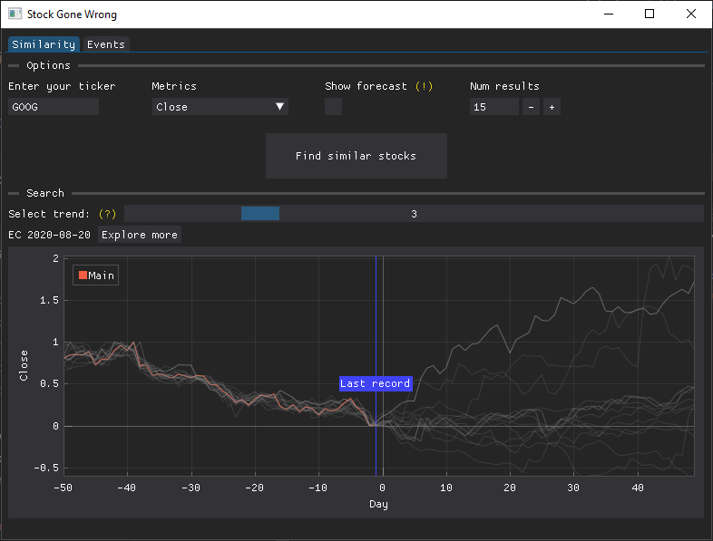
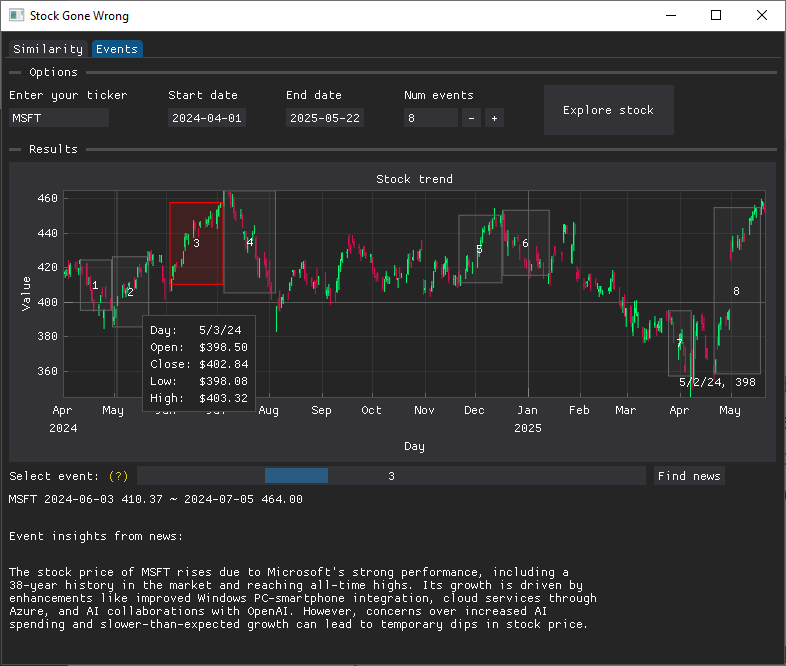

# Stock Gone Wrong

Analyzing the triggers behind market meltdowns.

## Screenshots




## Download

Find the latest release in [Releases](https://github.com/CyrusCKF/stock-gone-wrong/releases)

## Installation

Run

```bash
# (recommended) create and activate python environment
pip install -e .
python main.py
```

Build as executable

```bash
# activate python environment if valid
package.bat
```
