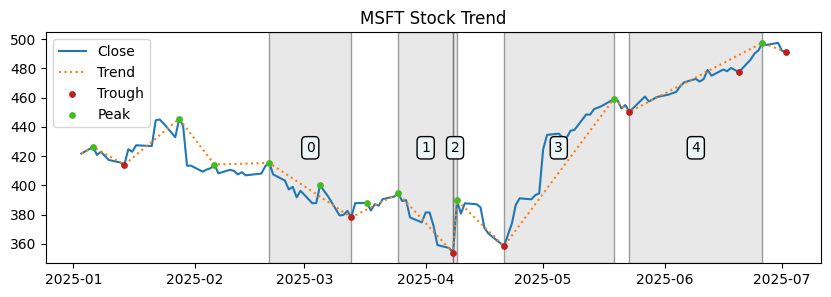

# stock-gone-wrong

Analyzing the triggers behind market meltdowns.

## Example



### *Insights of 3*

> MSFT rises from 358.46 in 2025-04-21 to 458.87 in 2025-05-19

Why?  
Microsoft's stock price rise is attributed to its strong quarterly results that surpassed Wall Street estimates. The company's cloud-computing revenue, particularly from its AI and Azure platform, saw significant growth. Additionally, upbeat changes in analysts' estimates indicate a favorable outlook on Microsoft's business health and profitability, contributing to the stock price increase.

Sources: [1](https://www.tastylive.com/news-insights/microsoft-msft-earnings-preview-ai-growth-market-uncertainty), [2](https://www.nasdaq.com/articles/microsoft-msft-beats-stock-market-upswing-what-investors-need-know-0), [3](https://www.investopedia.com/why-microsoft-stock-had-one-of-its-best-post-earnings-days-in-a-decade-11726613)

## Installation

Run

```bash
pip install -e .
```
